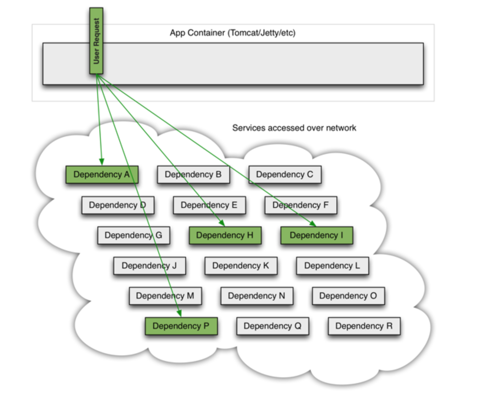
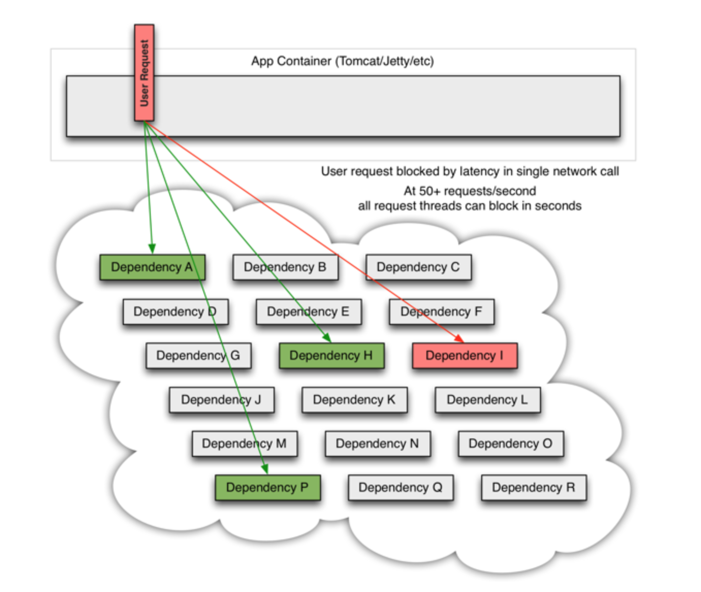
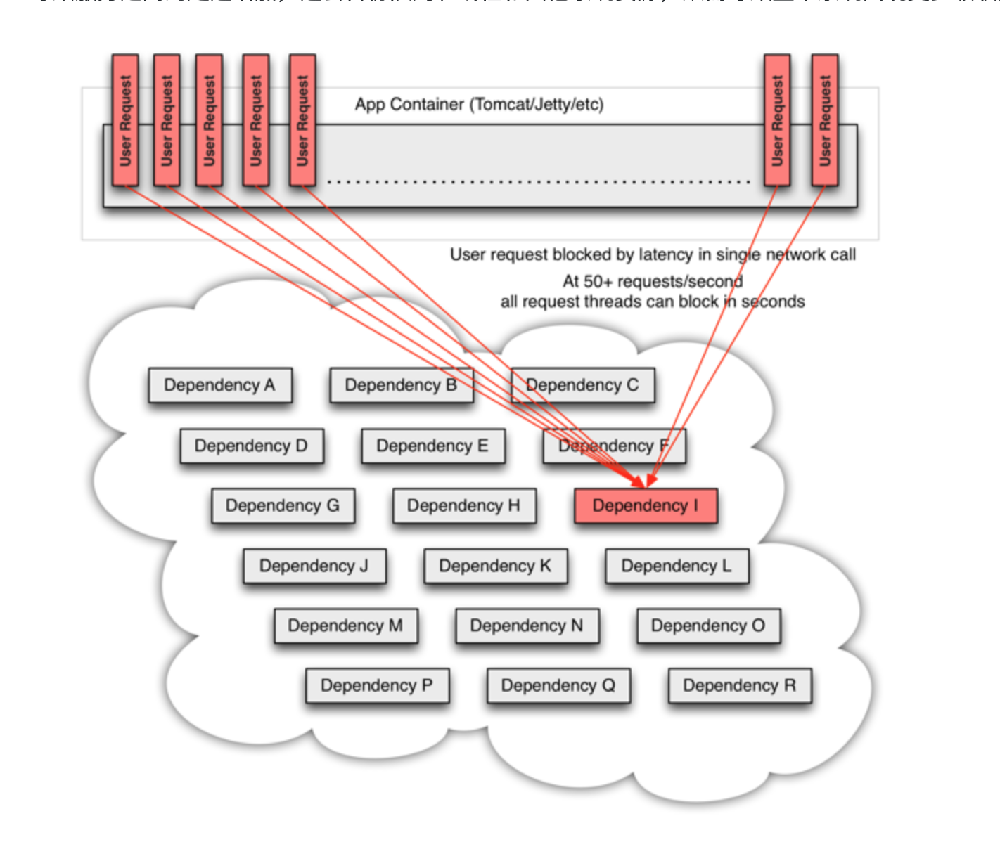
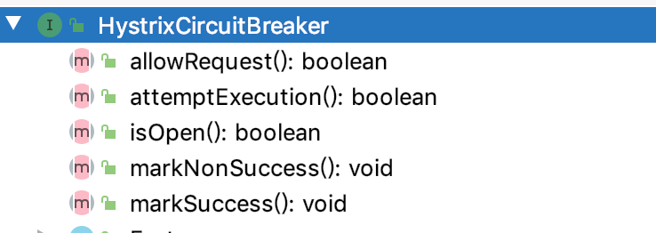

## What

> Hystrix is a latency and fault tolerance library designed to isolate points of access to remote systems, services and 3rd party libraries, stop cascading failure and enable resilience in complex distributed systems where failure is inevitable.

Key：容错、故障恢复、隔离、避免级联故障。

Hystrix 旨在执行以下操作：

- 通过第三方客户端库访问的依赖项（通常通过网络）提供延迟和故障的保护和控制。
- 停止复杂分布式系统中的级联故障。
- 快速失败并快速恢复。
- 在可能的情况下回退并优雅地降级。
- 实现近乎实时的监控、警报和操作控制。

### 解决了什么问题？

正常请求时：



某个接口出现问题时：



流量激增导致的后果：



## how

构造 command 类 → request cache → circuit-breaker → thread pool/semaphore → run

### request cache

核心数据结构

```java
// the String key must be: HystrixRequestCache.prefix + concurrencyStrategy + cacheKey
private static final ConcurrentHashMap<RequestCacheKey, HystrixRequestCache>caches= new ConcurrentHashMap<>();
```

就是按照前缀 + Cache Key 组成的一个 Map 结构。

### Circuit Breaker（断路器）




断路器有三个状态：打开、关闭和半开。断路器的运行就是围绕着这三个状态展开的。

- allowRequest 方法是对断路器状态的判断。如果打开断路器，return false。如果距离打开断路器一段时间（默认五秒）则会尝试请求接口。
- attemptExecution 方法如果断路器已经打开，则判断时间，如果超过默认等待时间，则尝试请求。
- 其它的类似。

### Thread Pool

源码在 `[HystrixThreadPool.java](http://hystrixthreadpool.java)` 里面。就是使用了 Java 的线程池，让任务在线程池中执行。